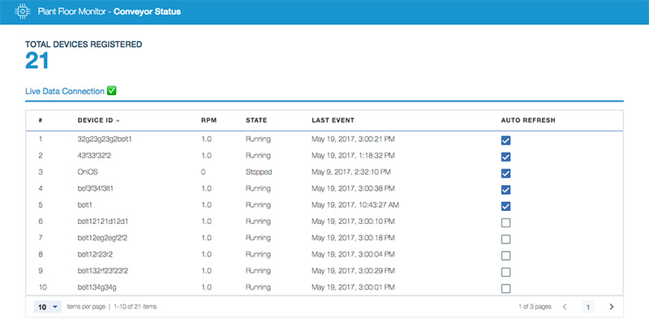

## Watson IoT Platform getting started guides
This sample application is included as a component in a set of Getting Started guides that step through the basics of developing a ready-for-production, end-to-end IoT prototype system with Watson IoT Platform.

Developers who are new to working with Watson IoT Platform can use the step-by-step processes in the Getting Started guides to develop and deploy a solution that demonstrates one or more Watson IoT Platform features.

For more information about the getting started guides, see the [Watson IoT Platform documentation](https://console.bluemix.net/docs/services/IoT/getting_started/getting-started-iot-overview.html).

# MonitoringControl


## Set-up
In your IBM Watson IoT Platform service, generate a new application API key.
Watson IoTP `<wiotp-org-id>.internetofthings.ibmcloud.com/dashboard/#/apps/apikeys-v2`

Set the application permissions to the lowest level it requires: Visualization Application. If you add more features to the application, you'll need to elevate it to a higher role.


Docs: https://bluemix.net/docs/services/IoT/platform_authorization.html#api-key

## To Run Locally

1. Run **`npm install -g @angular/cli`** to install the Angular CLI
2. Run **`npm install`**
3. Create a file named **basicConfig.json** in the root folder of this repo with this content:
```json
{
  "org":      "{{your_org_ID}}",
  "apiKey":   "{{your_API_key}}",
  "apiToken": "{{your_API_token}}"
}
```
4. Run `npm run build-run` to build the project and start the app.
5. Go to [http://localhost:3000](http://localhost:3000) on your browser

## To Deploy to Bluemix

1. Run **`npm install -g @angular/cli`** to install the Angular CLI
2. Run **`npm install`**
3. Create a file named **basicConfig.json** in the root folder of this repo with this content:
```json
{
  "org":      "{{your_org_ID}}",
  "apiKey":   "{{your_API_key}}",
  "apiToken": "{{your_API_token}}"
}
```
4. Run **`npm run push`** to build the project and push using **Cloud Foundry**.

This project was generated with [Angular CLI](https://github.com/angular/angular-cli) version 1.0.0-rc.1.

# Privacy notice

This web application includes code to track deployments to [IBM Bluemix](https://www.bluemix.net/) and other Cloud Foundry platforms. The following information is sent to a [Deployment Tracker](https://github.com/cloudant-labs/deployment-tracker) service on each deployment:

* Application Name (`application_name`)
* Space ID (`space_id`)
* Application Version (`application_version`)
* Application URIs (`application_uris)``

This data is collected from the `VCAP_APPLICATION` environment variable in IBM Bluemix and other Cloud Foundry platforms. This data is used by IBM to track metrics around deployments of sample applications to IBM Bluemix to measure the usefulness of our examples, so that we can continuously improve the content we offer to you. Only deployments of sample applications that include code to ping the Deployment Tracker service will be tracked.

## Disabling deployment tracking

Deployment tracking can be disabled by removing the require("cf-deployment-tracker-client").track(); line from the 'app.js' file.

## Useful links
[Install Node.js]: https://nodejs.org/en/download/
[bluemix_dashboard_url]: https://console.ng.bluemix.net/dashboard/
[bluemix_signup_url]: https://console.ng.bluemix.net/registration/
[cloud_foundry_url]: https://github.com/cloudfoundry/cli

[IBM Bluemix](https://bluemix.net/)  
[IBM Bluemix Documentation](https://www.ng.bluemix.net/docs/)  
[IBM Bluemix Developers Community](http://developer.ibm.com/bluemix)  
[IBM Watson Internet of Things](http://www.ibm.com/internet-of-things/)  
[IBM Watson IoT Platform](http://www.ibm.com/internet-of-things/iot-solutions/watson-iot-platform/)   
[IBM Watson IoT Platform Developers Community](https://developer.ibm.com/iotplatform/)
